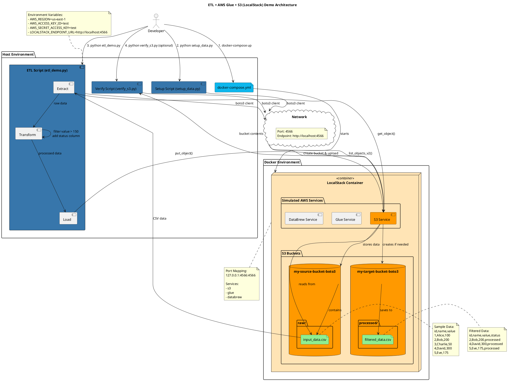

```plantuml
@startuml ETL_Demo_Architecture

!define RECTANGLE class
!define CLOUD cloud
!define DATABASE database
!define COMPONENT component

title ETL + AWS Glue + S3 (LocalStack) Demo Architecture

' 定义颜色
!define LocalStackColor #FFE4B5
!define DockerColor #0db7ed
!define PythonColor #3776ab
!define S3Color #ff9900
!define DataColor #90EE90

' Docker 容器层
package "Docker Environment" as docker_env {
    
    ' LocalStack 容器
    node "LocalStack Container" as localstack <<container>> LocalStackColor {
        
        ' AWS 服务模拟
        package "Simulated AWS Services" as aws_services {
            component "S3 Service" as s3_service S3Color
            component "Glue Service" as glue_service 
            component "DataBrew Service" as databrew_service
        }
        
        ' 存储
        package "S3 Buckets" as s3_buckets {
            database "my-source-bucket-boto3" as source_bucket S3Color {
                folder "raw/" as raw_folder {
                    file "input_data.csv" as input_file DataColor
                }
            }
            
            database "my-target-bucket-boto3" as target_bucket S3Color {
                folder "processed/" as processed_folder {
                    file "filtered_data.csv" as output_file DataColor
                }
            }
        }
    }
}

' 主机环境
package "Host Environment" as host_env {
    
    ' Python 脚本
    component "ETL Script (etl_demo.py)" as etl_script PythonColor {
        component "Extract" as extract
        component "Transform" as transform  
        component "Load" as load
    }
    
    ' 辅助脚本
    component "Setup Script (setup_data.py)" as setup_script PythonColor
    component "Verify Script (verify_s3.py)" as verify_script PythonColor
    
    ' 配置文件
    file "docker-compose.yml" as compose_file DockerColor
}

' 开发者/用户
actor "Developer" as developer

' 网络连接
cloud "Network" as network {
    note as network_note
        Port: 4566
        Endpoint: http://localhost:4566
    end note
}

' 关系和流程
developer --> compose_file : 1. docker-compose up
compose_file --> localstack : starts

developer --> setup_script : 2. python setup_data.py
setup_script --> network : boto3 client
network --> s3_service : create bucket & upload
s3_service --> source_bucket : stores data
source_bucket --> input_file : contains

developer --> etl_script : 3. python etl_demo.py
etl_script --> network : boto3 client

' ETL 流程
extract --> s3_service : get_object()
s3_service --> input_file : reads from
input_file --> extract : CSV data

extract --> transform : raw data
transform --> transform : filter value > 150\nadd status column
transform --> load : processed data

load --> s3_service : put_object()
s3_service --> target_bucket : creates if needed
target_bucket --> output_file : saves to

developer --> verify_script : 4. python verify_s3.py (optional)
verify_script --> network : boto3 client
network --> s3_service : list_objects_v2()
s3_service --> verify_script : bucket contents

' 数据流注释
note right of input_file
    Sample Data:
    id,name,value
    1,Alice,100
    2,Bob,200
    3,Charlie,50
    4,David,300
    5,Eve,175
end note

note right of output_file
    Filtered Data:
    id,name,value,status
    2,Bob,200,processed
    4,David,300,processed
    5,Eve,175,processed
end note

' 环境变量注释
note top of etl_script
    Environment Variables:
    - AWS_REGION=us-east-1
    - AWS_ACCESS_KEY_ID=test
    - AWS_SECRET_ACCESS_KEY=test
    - LOCALSTACK_ENDPOINT_URL=http://localhost:4566
end note

' 端口映射注释
note bottom of localstack
    Port Mapping:
    127.0.0.1:4566:4566
    
    Services:
    - s3
    - glue  
    - databrew
end note

@enduml
```